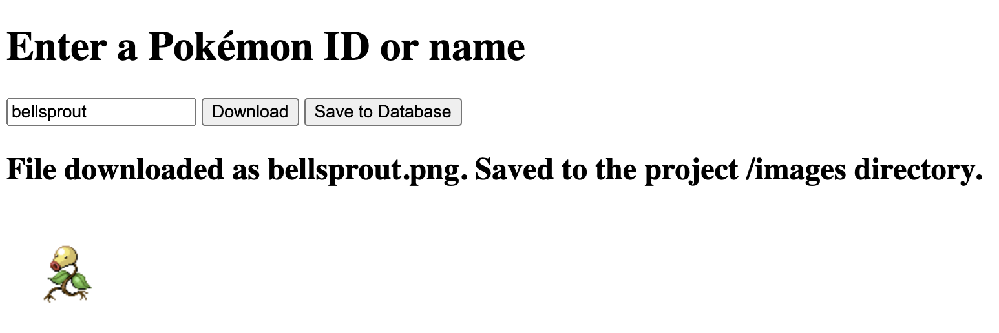
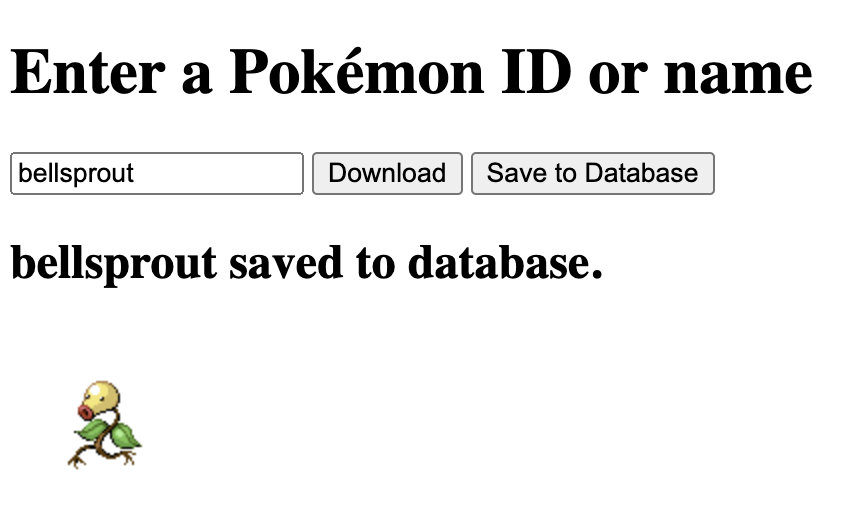

# Pokemon Image Downloader

This application connects to the **PokéAPI** at https://pokeapi.co/
to download an image of a given Pokémon.
Input can be the ID or name of any Pokémon.

The **Download** button saves the image to the **/images** directory in the project location.

The **Save to Database** button saves a Pokémon to an **sqlite** database with a link to its image source.

The application runs on **Node.js** using the **Electron.js** framework.
It connects to **PokéAPI** using the **Fetch** API.

*Bellsprout can be saved or downloaded by using its name or ID as input.*
___
### How to Run
To run this, installing the **Node** packages using `npm install` is the only necessary setup.
Using `npm start` will launch the application.
