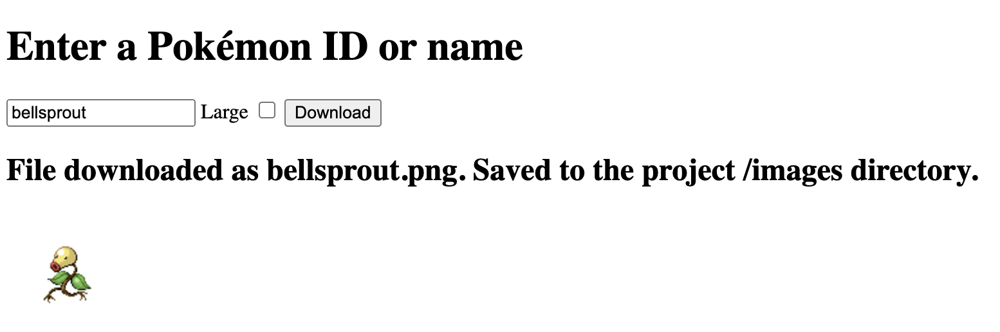
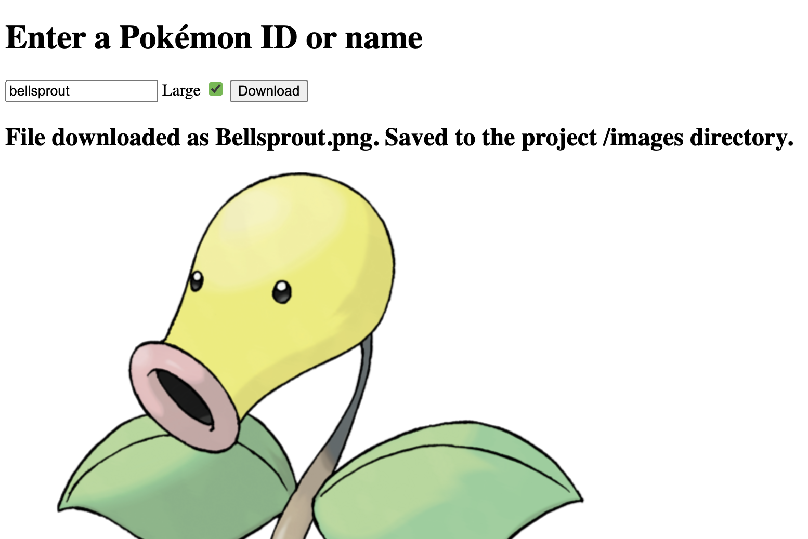

# Pokemon Image Downloader
This application connects to the **PokéAPI** at https://pokeapi.co/
to download an image of a given Pokémon.
Input can be the ID or name of any Pokémon.

Larger Pokémon images may be requested. This application will use
the **Bulbapedia** wiki as a source for larger images.

The image is saved to the **/images** directory in the project location.

The application runs on **Node.js** using the **Electron.js** framework.
It connects to **PokéAPI** using the **Fetch** API.

*Bellsprout can be downloaded by using its name or ID as input.*

*A larger image can be requested. Sources image from Bulbapedia.*

### How to Run
To run this, installing the **Node** packages using `npm install` is the only necessary setup.
Using `npm start` will launch the application.
